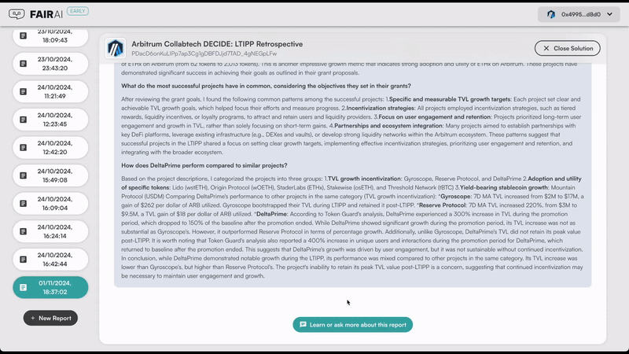

## Context

We are developing [FairAI, a decentralized AI marketplace](https://getfair.ai/). In our platform, businesses can submit requests for problems they have, and developers can provide open-source AI solutions to address those real-world issues. These solutions are then automatically connected to our platform's enlisted hardware providers, ensuring composable, verifiable, and transparent AI computation. This setup allows end-users and businesses to easily access and retain high-quality AI responses while maintaining more control over the model and its operator without incurring infrastructure costs. You can check an image explaining this concept on the image below:

  

## Problem

Analyzing the effectiveness of incentive programs within the Arbitrum ecosystem can be quite challenging. Even with dashboards and reports available, interpreting the data often requires specialized knowledge, and they frequently fail to address the most critical questions. Furthermore, gathering additional information from various sources, which is typically not included in these dashboards and reports, is often necessary. The same difficulties arise when evaluating grant proposals—there’s usually an overwhelming amount of information and insufficient time and resources to analyze it effectively.

A clear example of this was seen in the LTIPP incentive program. Despite OpenBlock's efforts to collect data and information for evaluating the program, the Arbitrum stakeholders still struggled during [the call to present their findings](https://drive.google.com/file/d/1glTdpNX7s7HlnhkB3mfUcpyjlwybQU8h/view). They had difficulty getting their questions answered and understanding how to interpret the reports, data, and dashboards in order to draw meaningful conclusions.

## Idea and Project

To optimize Arbitrum's incentive programs, we designed an AI system that assists Arbitrum decision-makers by utilizing both on-chain and off-chain data. We named this system Data-Enhanced Coordination for Intelligent Decision-Making on Grants, or DECIDE for short. We recognized these challenges more clearly as we began using Arbitrum USD for payments on our marketplace and attended various Arbitrum events. Engaging with key ecosystem members and participating in calls hosted by the Arbitrum Foundation gave us insight into the difficulties in understanding and evaluating these incentive programs or grant proposals. This deeper understanding led us to conceptualize a PoC to prove DECIDE's effectiveness.

By analyzing just a limited selection of data from various projects within the LTIPP incentive program, we generated an AI system capable of producing a report that addresses questions posed by key members from the Arbitrum ecosystem in the forum and ArbitrumDAO meetings. This demonstrates the effectiveness of the AI system and highlights the solution's potential when applied to a larger dataset.

  

By creating this PoC, we aim to save time and resources while maximizing the potential and impact of grants awarded within the Arbitrum ecosystem. We built this AI system on top of the [FairAI marketplace mentioned above](https://getfair.ai/), taking advantage of its composability, verifiability, and transparency. Besides being way faster, cheaper, and trustless compared with mainstream reports, another advantage of a system like this is that individuals can pose questions, request summaries, or discuss the generated reports with the AI system. We also built a PoC for this feature for the hackathon:

  

## Architecture

Our proof of concept (PoC) for participating in the Arbitrum CollabTech Hackathon consists of several components: the AI component, and the front-end interface that allows users to interact with the AI. Both components have been deployed on the FairAI marketplace, enabling the solution to be accessible and allowing anyone to contribute computing resources for this PoC. This setup ensures the necessary scalability to handle an unlimited number of requests. Each part is detailed below.

**AI Component:** For this AI solution, we utilized data from the proposals of projects that participated in the LTIPP program, along with reports created to analyze the program, such as those from [OpenBlock](https://www.openblocklabs.com/research/arbitrum-ltipp-efficacy-analysis) and [Tokenguard](https://drive.google.com/file/d/19rrYt3D200l4oTbxaUBq2qsXveKFls0L/view). This AI component consists of various parts that enable the system to function effectively.

For example, we employed prompt engineering to formulate the report's questions. Additionally, we developed a Retrieval-Augmented Generation (RAG) system designed to answer open-ended questions about the projects involved in LTIPP, as well as summarize and structure the questions used for prompt engineering. 

The files that comprise this AI component include:

- **Data Folder**: This folder contains the files used to provide context for the questions in the report. This data will be utilized for prompt engineering, specifically through the 'prompts.py' file. The OpenBlock and TokenGuard reports are part of this data. Additionally, we have used the best available open-source LLM (Llama 3.1:405b) to summarize some of the proposals from the projects that participated in LTIPP, using the code from the 'rag.py' file. This approach was implemented to facilitate summarization and to prevent the real-time report generation from taking too long.

## Hardware and Code Files Description

**prompts.py:** This script focuses on prompt engineering to effectively answer each question in the report. The goal is to gather relevant information to address the questions and formulate them in the best possible way for submission to the AI models.

**rag.py**: This script contains the code necessary for users of this proof of concept (PoC) to ask open-ended questions and create customized reports based on their interests. We have developed a strategy that allows users to inquire about any project that participated in LTIPP. Given the limited context that large language models (LLMs) can process, we implemented a method to filter only the relevant information.

When a user poses a question, we utilize a lighter LLM to relate the question to the names of the projects associated with LTIPP. We then pass instructions on how to return a JSON object containing the names of projects that match the user's inquiry. Since the lighter LLM is designed for speed, it may occasionally produce inaccurate outputs. To address this, we created functions that can read the JSON even if the model's response is incomplete, and we developed a search function to verify that the suggested project names are accurate. If there are any errors, these can be corrected.

Once we have the correct JSON object, we use the links to the grant proposals for these projects to perform real-time web scraping of relevant data. This method allows us to gather pertinent information even when the question involves a comparison between different projects. Since the volume of data will be extensive and exceed the context limits of LLMs, we have written code to convert the data into embeddings (numerical representations of each word). We also transform the user's question into embeddings, enabling us to conduct searches and extract only the relevant information from the complete dataset.

With all the necessary context established, we can then feed the most powerful LLM the refined information to answer the user's question.

**hack_server.py**: This script functions as a server, utilizing the Flask framework to create routes that handle incoming requests. It forwards these requests to various AI functions, such as generating reports based on predefined questions (sourced from the prompts.py file) and answering open-ended questions (using code from the rag.py file).

Since we are leveraging a heavy model to ensure high-quality responses for report generation—an operation that requires significant time for inference—we've implemented a caching mechanism. This allows us to return cached reports, which will be utilized during live demos or if someone wants to test the application.

If you're interested in bypassing the cache, simply call the function without caching, ensuring that the llama3.1:405b model is running locally. For open questions, we use the llama3:70b model, which doesn't employ caching since the answers are dynamic. For this reason, we will ensure that this model is always live.

**AI Models Used:** We utilized three open-source models (llama3, llama3:70b, and llama3.1:405b) to perform our inferences. We employed the [Ollama framework](https://github.com/ollama/ollama), which enables us to run the models locally, but you could opt for any other method or even use different open-source models. Our code is designed to be compatible with any open-source AI model.

Regarding hardware, we used an Nvidia GeForce 4090 to run the llama3 and llama3:70b models, while the llama3.1:405b model was set up on Runpod using three A100 GPUs. For a tutorial on how to do this, you can refer to [this link](https://docs.runpod.io/tutorials/pods/run-ollama). Again, this setup could be accomplished using other methods, but we chose the most efficient option given the limited time available during the hackathon.

## Vision

Regarding this project, imagination is the limit to improving it. We envision an AI solution that allows users to have more questions answered. In addition to the tailored data processing we currently provide, we could incorporate data streaming, enabling the AI to generate reports based on real-time, updated data. We can enhance the data used for this solution by applying techniques such as sentiment analysis on social media discussions related to the projects and utilizing on-chain data to assess how the project contributes to the Arbitrum ecosystem and identify related patterns. The chat feature could not only allow users to inquire about the data we have gathered on the project but also about the generated report itself. Finally, this entire system can be continually refined and adapted for each specific future grant.

## What to Do Next

[Try our solution!](https://app.getfair.ai/#/collabtech-hackathon-decide)

[Check our original demo video!](https://youtu.be/-ld9V-un71c)

[Check our video for the pitch day!](https://youtu.be/swomsr_nI6Y)

## Team

[Eduardo Correia](https://www.linkedin.com/in/eduardoxcorreia/) - Front-end development and design

[Luís Silvestre](https://www.linkedin.com/in/l-silvestre/) - Full-stack development and research

[Márcio Guia](https://www.linkedin.com/in/marcio-guia/) - AI development and research

[Tiago Ferreira](https://www.linkedin.com/in/carlostiagoferreira/) - Product and research

## More Information

We submitted two grant proposals under Questbook’s “Arbitrum New Protocols and Ideas 2.0” program that are related to the AI system mentioned above. With the [first proposal](https://questbook.app/dashboard/?proposalId=663ec3d47d71679fa9a3852c&chainId=10&grantId=662f31c25488d5000f055a54&role=community), we suggested the creation of two chatbots and their respective interfaces for querying information related to the STIP and LTIPP programs. This proposal has been accepted and developed, and you can preview the solution in the images below, or explore it in our marketplace. We are still awaiting the final decision on the [second proposal](https://questbook.app/dashboard/?proposalId=66d1b7902047c84bb80fe75b&chainId=10&grantId=662f31c25488d5000f055a54&role=community&isRenderingProposalBody=true), which focuses on building a multi-modal grant analyzer for the Questbook grants.

  

  

